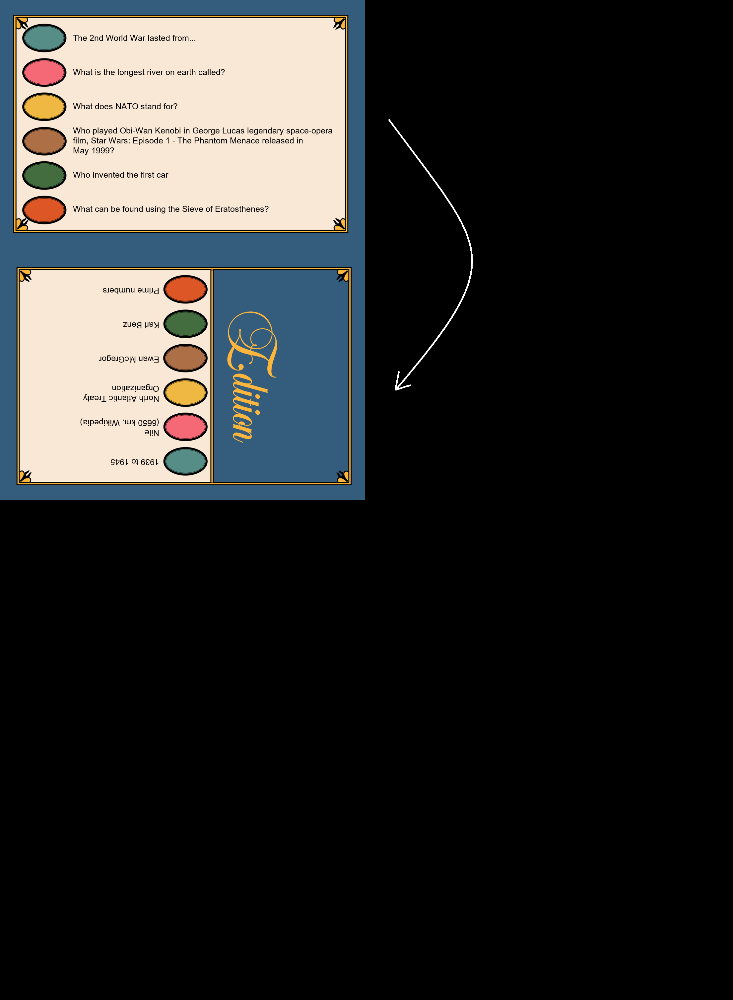

# TrivialPursuitFramework

# Create your own cards
This framework creates question cards for the game Trivial Pursuit. 
Just create a `questions.txt` file and insert it to the questions folder, think about six categories, put them in a `categories.txt` file in the same folder and start the `trivial_pursuit_creator.py` script.

`python trivial_pursuit_creator.py`

The script will lead you through the single steps (split up in the python scripts which can be found here) and helps to generate your printable question cards. The single scripts can also be run individually as described below in each section for the script.

Please read the following sections of the *Create your own cards* chapter to make sure, your `questions.txt` and `categories.txt` are well-formed and you understand, what is happening. Please write an issues, if you have any problems. 

*Example cards for a German Star Trek Trivial Pursuit*

If you execute the script, it will create the `out` folder which contains all question cards `frontX.png` (with six questions each) and their associated answer cards `backX.png`. It also creates printable card sheets in the `prints` folder, where the cards are organized in a way, that you can just print those sheets, cut a card, fold it up as shown below and glue it together, so that your are finished super fast!
This repository already contains both folders with a blank example card and sheet, so that you can better see what the script can do for you.  

## questions.txt
Your `questions.txt` file must be look as follows:

**Q: What is the name of the first president of the United States of America?**    
**A: George Washington**  
**C: H**  

**Q: What is the longest river on earth called?**  
**A: Nile**  
**C: G**  

...

Every questions needs a question after a **Q:**, an answer at **A:** and one letter for the category **C:**

An example can be found in the `questions.txt` provided in this repository.

## categories.txt
The `categories.txt` file is much more simple. Just put six categories in there like that:  
**H: History**  
**G: Geopraphy**  
**P: Politics**  
**A: Actors**  
**I: Inventions**  
**M: Mathematics**

### Prepare your question cards
You have to prepare your cards with your *categories* and your *edition*, before filling them with questions. You can do this by changing `assets/back.png` and `assets/front.png` with an image editing program of your choice. Simply add the letters for your categories in the coloured ellipses. Use the same order as in the `categories.txt` file. Then add an edition name using the **Balmorall** font. You could for example find it [here](https://www.dafontfree.net/freefonts-balmoral-icg-f114221.htm)   

A question card consists of 6 questions. A questions has an answer and is assigned to a category defined in the `categories.txt` file. Each answer could contain a citation, especially useful for film quizes, which is always written in brackets (). 

# Running scripts individually
In this chapter, the single steps of the `trivial_pursuit_creator.py` script will be explained.

##### questions_to_database.py
It starts with executing the `questions_to_database.py` script. This script reads the `questions.txt`, creates the SQLite database `python_sqlite.db` and write all questions, answers and their categories to the database. A good first introduction to python and SQLite can be found [here](https://www.sqlitetutorial.net/sqlite-python/sqlite-python-select/). If a questions i already in the database (questions is unique), this question will be skipped and a warning appears. Make sure, your `questions.txt` file is well-formed before starting this process. You can continue by pressing **ENTER**

##### database_tools.py
Now the script check if there are any issues with questions, answer or the categories. The questions for example could be too long for a card, also the answers. The script takes this lengths from the `constants.py` file. It also checks things like, is there a question mark or a ... (for famous phrases which should be completed) at the end of a question or are the categories valid categories from the `categories.txt` file. The script will then print warnings and errors and will guide you to the next step.

##### database_statistics.py
If there are no critical errors, it continues running the `database_statistics.py`. This script prints the number of available questions of each category and calculates how many cards can be created. Keep in mind, that each card contains six questions of the six different categories. 

##### create_cards.py
Now the card creation process can be started. The script takes questions from the database (one for each category) and draw them on a card. (They are taken shuffled, to switch of this shuffling, change the shuffle variable in `constants.py` to *False*) If there are no more questions of one category, the script stops and print statistics on what it has done. Check the ignored questions count to understand what category is missing some new questions. You should now see `frontX.png` and `backX.png` files in the `out` folder. In your answers you can provide a citation, which is just done by adding somethin in brackets () at the end of your answer. You can also write a special hint or continuing information in this brackets. Those citations or information will be written to an extra line for the answer. So you can force a new line, if you want to give further information. In the example questions, you can see this at the *Nile (6650km, Wikipedia)* answer.

##### print_cards.py
Now all cards from the `out` folder are taken and put on a white piece of paper. Those can now be printed, cut and glued together and voila you have your own question card.